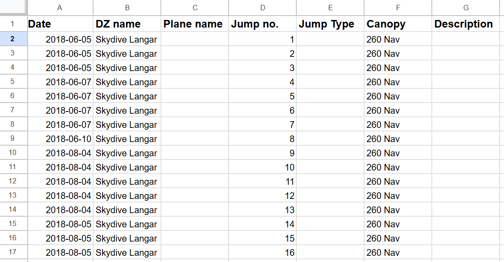

# Instructions for reuse
Running this script will monitor burble, once your name appears on a load it will update your logbook, there is also functionality to update my camera invoice so delete it if you dont need it.

## Step 1 
- Pull code from repo
- Use config within monitor.js to create .env file 

## Step 2 - Google cloud console
- Create google cloud console project 
- Enable google sheets API
- Create service account
- Export the credentials.json

## Step 3 
- Add the credentials.json within the spreadsheets directory and copy/paste to the root directory
(cba to understand why, this project already took too much time)

## Step 4
- Add Spreadsheet ID to .env file
- Share google sheet with service account

## Step 5
- Have correct logbook layout:

(export your jumps from burble to make the logbook setup quick)

Image dropdown

## Step 6 
- Remove the shutdown method if not updating camera invoice 